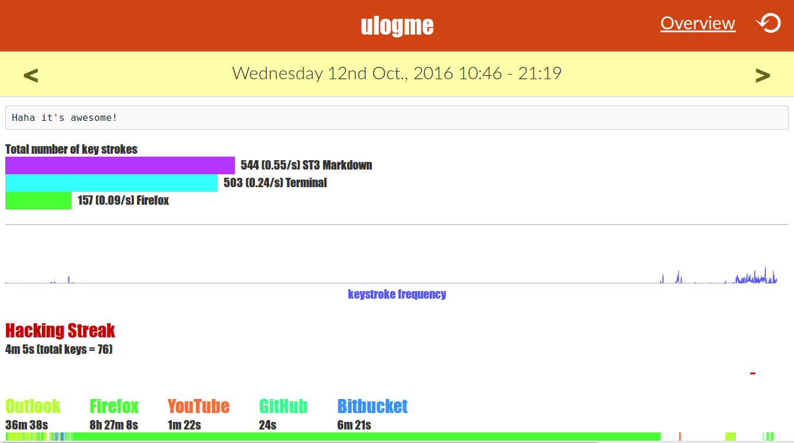
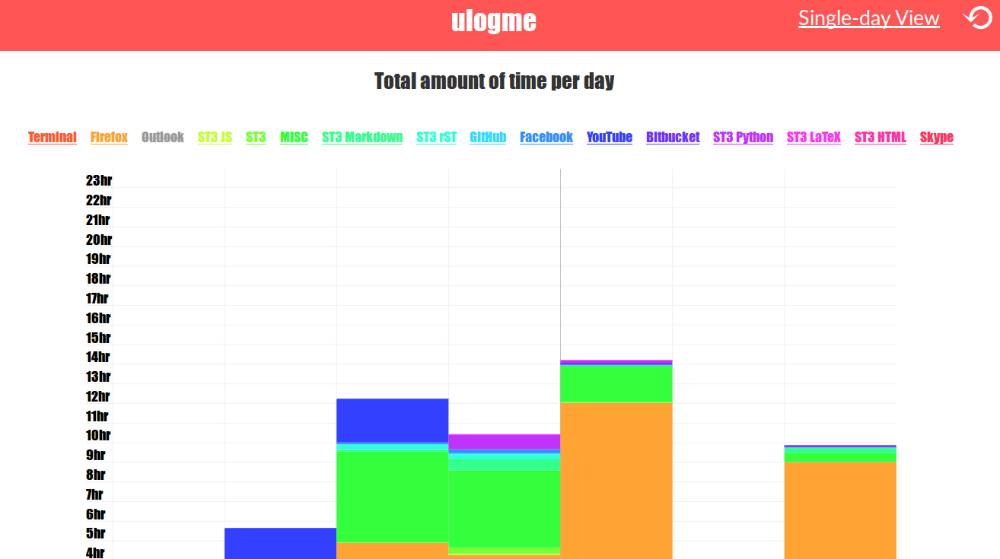

# **ulogme**

> ### How productive were you today? How much code have you written? Where did your time go?

Keep track of your computer activity throughout the day: visualize your active window titles and the number of keystrokes, in beautiful HTML timelines.

Current features:

- Records your **active window** title throughout the day
- Records the **frequency of key presses** throughout the day (but not the actual key: no security threat)
- Record custom **note annotations** for particular times of day, or for day in general
- Everything runs **completely locally**: *none* of your data is uploaded anywhere
- **Beautiful, customizable UI** in HTML/CSS/JS (using [d3js](https://www.d3js.org/)).

The project currently **only works on Ubuntu** or Debian-like Linux (for an OSX version, see [the original project](https://github.com/karpathy/ulogme)).
It uses the new fancy [`Promises`](https://developer.mozilla.org/en-US/docs/Web/JavaScript/Reference/Global_Objects/Promise) feature of ECMAScript 6. This might not be implemented in all browsers, but recent one should have it (recent Chrome and Firefox are fine, at least).

## Screenshots
### "Daily view" page

### "Overview" page

## Demo (by [@karpathy](https://github.com/karpathy))
See a blog post (along with multiple screenshots) describing the project [here.](http://karpathy.github.io/2014/08/03/quantifying-productivity/)

----

## Getting started

**To start recording**

1. Clone the repository to some folder: `$ git clone https://github.com/Naereen/ulogme.git`
2. If you're on Ubuntu, make sure you have the dependencies: `$ sudo apt-get install xdotool wmctrl`. On Fedora, you may also need `$ sudo yum install gnome-screensaver`.
3. `cd` inside and run `$ ./ulogme.sh` (note: this will ask you for sudo authentication which is required for `showkey` command). This will launch two scripts. [One](keyfreq.sh) records the frequency of keystrokes and the [other](logactivewin.sh) records active window titles. Both write their logs into log files in the `logs/` directory. Every log file is very simple: just the unix time stamp followed by data, one per line (plain text file).

**The user interface**

1. **Important**. As *a one-time setup*, copy over [the example settings file](render/render_settings_example.js) to your own copy: `$ cp render/render_settings_example.js render/render_settings.js` to create your own `render_settings.js` settings file. In this file modify everything to your own preferences. Follow the provided example to specify title mappings: A raw window title comes in, and we match it against regular expressions to determine what type of activity it is. For example, the code would convert "Google Chrome - some cool website" into just "Chrome", or "GitHub - Mozilla Firefox" into just "GitHub". Follow [the provided example](render/render_settings_example.js) and read the comments for all settings in the file.
2. Once that is set up, start the web server viewer: `$ python ulogme_serve.py`, and go to [the provided address](http://localhost:8124) (for example `http://localhost:8124`) in your browser. Hit the refresh button on top right every time you would like to refresh the results based on most recently recorded activity (it erases cache). You can also use a convenience file [`ulogme_serve.sh`](ulogme_serve.sh) to do both: start the server, and open the web-page.
3. If your data is not loading, try to explicitly run `$ python export_events.py` and then hit refresh. This should only be an issue the very first time you run ulogme.

**If you are using [tmux](https://tmux.github.io/)**

1. The script `ulogme_tmux.sh` can be used to create a new tab in your current [tmux](https://tmux.github.io/) session, name it "uLogMe", split it in half vertically, and then it starts the user interface script in the left column, and the data recording in the right column. Very convenient!

**What is [tmux](https://tmux.github.io/)?**

1. The best terminal multiplexer. Just go [discover more by yourself](https://tmux.github.io/) (by @tmux).

----

## User Interface
The user interface can switch between a [single day view](render/index.html) and an [overview view](render/overview.html) by link on top. You have to hit the refresh button every time you'd like to pull in new data (and not your browser's refresh, Ctrl-R or F5, as it reads the cache by default).

#### Single day page
- You can enter a reminder "blog" on top if you'd like to summarize the day for yourself or enter other memos.
- Click on any bar in the *barcode view* to enter a custom (short) note snippet for the time when the selected activity began. I use this to mark meetings, track my coffee/food intake, sleep time, or my total time spent running/swimming/gym or to leave notes for certain patterns of activity, etc. These could all later be correlated with various measures of productivity, in future.

#### Overview page
- You can click the window titles to toggle them on and off from the visualization.
- Clicking on the vertical bars takes you to the full statistics for that day.

----

## Security concerns
- TODO explain how is it secure, what is stored etc.

### *How can I clean my data ?*
- Simply delete the `logs/` folder to completely remove your old data.

----

## Known issues
- You may see *"address already in use"* if you try to run `python ulogme_serve.py`. Sometimes the system can get confused and takes a while to update what ports are being used (or the port can be actually used by another software). Use the optional argument to specify a different port, for example `$ python ulogme_serve.py 8125` and then go to `http://localhost:8125/` instead, for example.
- Overview page is blank. Are you sure your browser supports ECMAScript 6 ? You can check it with these tools: [ES6 checker](https://ruanyf.github.io/es-checker/) or [Compat-Table ES6](https://kangax.github.io/compat-table/es6/). Any recent browser should be fine (Chrome and Firefox, at least).

----

## Explanations on the architecture
- The Ubuntu and OSX code base are a little separate on the data collection side (note: I am NOT keeping the OSX code in [my fork](https://github.com/Naereen/ulogme/), cf. the [original project](https://github.com/karpathy/ulogme/)).
- However, they each just record very simple log files in `/logs`.
- Once the log files are written, `export_events.py` takes the log files, does some simple processing and writes the results into `.json` files in [`/render`](render/).
- The Javascript/HTML/CSS UI codebase is all common and all lives in [`/render`](render/).

### Ubuntu (or any Debian-like Linux)
ulogme has three main parts:

1. Recording scripts [`keyfreq.sh`](keyfreq.sh) and [`logactivewin.sh`](logactivewin.sh). You probably will not touch these.
2. Webserver: [`ulogme_serve.py`](ulogme_serve.py) which wraps Python's `SimpleHTTPServer` and does some basic communication with the UI. For example, the UI can ask the server to write a note to a log file, or for a refresh. [`ulogme_serve.sh`](ulogme_serve.sh) helps to launch the Python web server more easily.
3. The UI. Majority of the codebase is here, reading the `.json` files in [`/render`](render/) and creating the visualizations. There are several common `.js` files, and crucially the [`index.html`](index.html) and [`overview.html`](overview.html) files, that are simple HTML template (with a lot of Javascript in the beginning). Feel free to adapt them to your preferences. I expect that most people might be able to contribute here to add features/cleanup/bugfix.
4. *Bonus:* the `ulogme_tmux.sh` script, if you are using [tmux](https://tmux.github.io/).

### OSX code
> Not in my fork, refer to [the original project](https://github.com/karpathy/ulogme)

----

## Related projects ?
- [selfspy](https://github.com/gurgeh/selfspy), Log everything you do on the computer, for statistics, future reference and all-around fun. I also worked a little bit on [selfspy-vis](http://github.com/Naereen/selfspy-vis), some tools to visualize the data collected by [selfspy](https://github.com/gurgeh/selfspy).
- My minimalist dashboard, generated every hour with this bash script [GenerateStatsMarkdown.sh](https://bitbucket.org/lbesson/bin/src/master/GenerateStatsMarkdown.sh).

For more projects, [this question on Personal Productivity Stack Exchange](https://productivity.stackexchange.com/questions/13913/automatic-time-tracking-software-for-computer-work-for-windows-linux-mac) might be also worth a look.

- [WakaTime](https://wakatime.com/), to keep a finer track of your time while editing files on your text editor.
- [Munin](http://munin-monitoring.org/), can also help to keep track of the uptime (and many more stats) of your (Linux) machine.

## :scroll: License ? 
[MIT Licensed](https://lbesson.mit-license.org/) (file [LICENSE.txt](LICENSE.txt)).
© [Lilian Besson](https://GitHub.com/Naereen), 2016.

